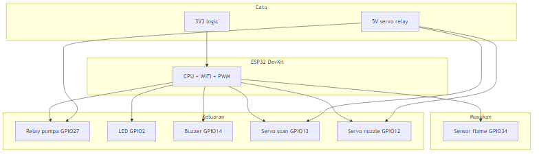
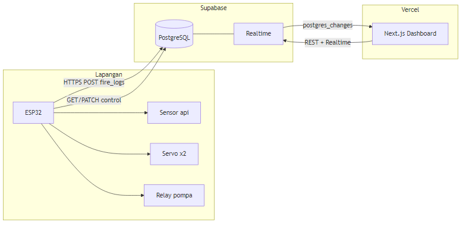
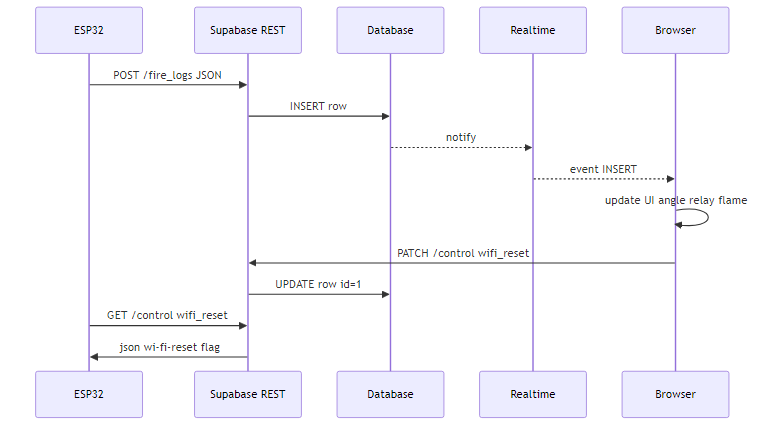
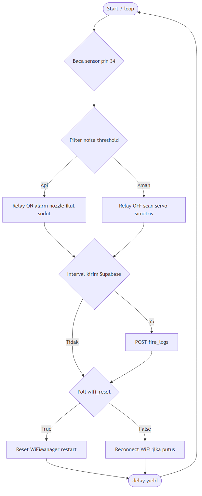
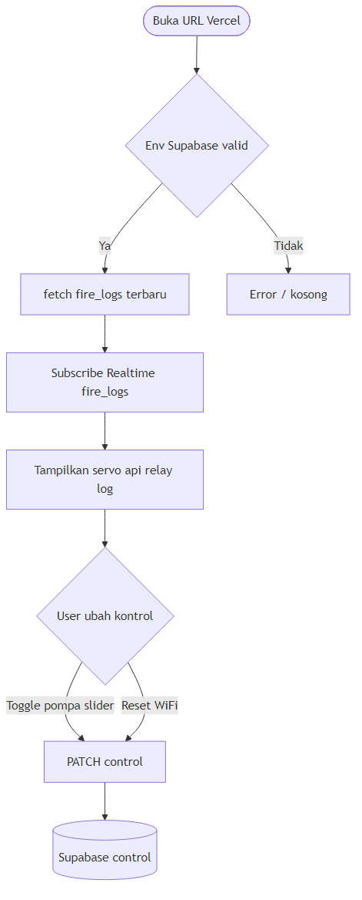

---
title: Laporan Proyek Fire Fighter System Monitor
subtitle: Sistem Pemantauan dan Kontrol Berbasis ESP32, Supabase, dan Next.js
date: 2026
---

# Fire Fighter System Monitor  
### Laporan dokumentasi proyek (tersedia juga sebagai file PDF)

**Judul:** Sistem Pemantauan dan Pengendalian Pemadam Kebakaran Berbasis IoT  
**Stack:** ESP32 · Supabase · Next.js (Vercel)  
**Tanggal penyusunan:** 2026  

---

## Daftar isi

1. [Pendahuluan](#1-pendahuluan)  
2. [Rumusan masalah dan tujuan](#2-rumusan-masalah-dan-tujuan)  
3. [Tinjauan komponen (hardware & software)](#3-tinjauan-komponen-hardware--software)  
4. [Arsitektur sistem](#4-arsitektur-sistem)  
5. [Alur data (sequence)](#5-alur-data-end-to-end)  
6. [Cara kode berjalan — firmware ESP32](#6-cara-kode-berjalan--firmware-esp32)  
7. [Diagram alur utama loop ESP32](#7-diagram-alur-utama-loop-esp32)  
8. [Cara kode berjalan — dashboard web (Next.js)](#8-cara-kode-berjalan--dashboard-web-nextjs)  
9. [Alur pengguna membuka dashboard](#9-alur-pengguna-membuka-dashboard)  
10. [Basis data Supabase](#10-basis-data-supabase)  
11. [Pengujian dan troubleshooting](#11-pengujian-dan-troubleshooting)  
12. [Kesimpulan dan saran](#12-kesimpulan-dan-saran)  
13. [Daftar referensi](#13-daftar-referensi)  

---

## 1. Pendahuluan

Kebakaran di lingkungan industri, perkantoran, atau laboratorium dapat menimbulkan kerugian materi dan nyawa. Sistem deteksi dini dan respons otomatis (misalnya penyiraman) membantu mengurangi risiko tersebut. Perkembangan **Internet of Things (IoT)** memungkinkan sensor dan aktuator dipantau dari jarak jauh melalui jaringan internet.

Proyek **Fire Fighter System Monitor** merancang sebuah **titik sensor berbasis ESP32** yang membaca kondisi sensor api, mengendalikan **servo**, **relay pompa**, **LED**, dan **buzzer**, serta mengirim data ke **cloud**. Di sisi server, **Supabase** menyimpan log sensor dan menyiarkan perubahan secara **realtime**. Aplikasi **web** dibangun dengan **Next.js** dan di-*hosting* di **Vercel** sehingga pengguna dapat memantau status lewat browser.

Laporan ini menjelaskan **komponen apa saja** yang terlibat, **alur** kerja dari hardware hingga tampilan web, serta **bagaimana kode dijalankan** pada setiap lapisan.

---

## 2. Rumusan masalah dan tujuan

### 2.1 Rumusan masalah

- Bagaimana data sensor dan aktuator di lapangan dapat **terlihat secara realtime** di dashboard?  
- Bagaimana **satu basis data** dapat diakses aman oleh **perangkat embedded** dan **browser**?  
- Bagaimana **reset konfigurasi WiFi** perangkat dapat diminta dari web tanpa kabel UART?

### 2.2 Tujuan

1. Merancang embedded system ESP32 dengan filter sensor dan kendali servo/relay.  
2. Mengintegrasikan penyimpanan dan *realtime pub/sub* memakai Supabase.  
3. Membangun antarmuka web dengan Next.js yang membaca perubahan data tanpa memuat ulang halaman penuh.  
4. Menyediakan dokumen aritektur dan alur untuk keperluan akademik atau *maintenance*.

---

## 3. Tinjauan komponen (hardware & software)

### 3.1 Komponen hardware (lapangan)

| No | Komponen | Fungsi singkat | Catatan |
|----|-----------|----------------|---------|
| 1 | Modul **ESP32** | Mikrokontroler + WiFi, menjalankan firmware Arduino | Pastikan catu dan GND stabil |
| 2 | **Sensor api / flame** (digital, pin 34) | Mendeteksi adanya api (logika: aktif LOW pada konfigurasi proyek) | GPIO 34 hanya masukan *input* |
| 3 | **Relay modul** (pin 27) | Menghidup/mematikan pompa atau beban AC/DC sesuai desain | Perhatikan *active low* di kode |
| 4 | **Servo motor** ×2 (pin 13 & 12) | Servo *scan* (radar) dan *nozzle* (arah semprotan) | Gunakan catu 5 V terpisah yang cukup |
| 5 | **LED** (pin 2) | Indikasi alarm visual | — |
| 6 | **Buzzer** (pin 14) | Alarm suara | — |
| 7 | **Catu daya** | 5 V untuk servo/relay, 3V3 untuk ESP | **GND bersama** |

### 3.2 Gambar blok komponen hardware

Diagram berikut merangkum hubungan logika antara ESP32, sensor, aktuator, dan catu daya.

### 3.3 Komponen software / layanan

| Komponen | Peran |
|----------|--------|
| **Arduino / ESP32 core** + **WiFiManager** | Program firmware, portal WiFi awal |
| **ESP32Servo** | Sinyal PWM servo |
| **HTTPClient** | REST ke Supabase |
| **Supabase** | PostgreSQL + PostgREST + Realtime |
| **Next.js 16 + React 19** | UI dashboard |
| **Supabase JS client** | Query + *realtime subscription* di browser |
| **Vercel** | *Deploy* aplikasi web |

---

## 4. Arsitektur sistem

Arsitektur mengikuti pola **hub-and-spoke**: semua komunikasi melewati **Supabase**. ESP tidak berkomunikasi langsung dengan domain Vercel; yang sama-sama diakses adalah **URL project Supabase**.

**Penjelasan singkat gambar:** ESP32 mengirim data pengukuran ke tabel `fire_logs` dan membaca/memutakhirkan baris `control` (misalnya *flag* `wifi_reset`). Browser memuat aplikasi Next.js dari Vercel, lalu berlangganan **Realtime** Supabase agar UI ikut berubah ketika baris baru masuk ke `fire_logs`.

---

## 5. Alur data (end-to-end)

Diagram *sequence* berikut menunjukkan urutan pesan saat ESP mengirim log, browser menerima *event* realtime, dan saat perintah kontrol/reset lewat tabel `control`.

Secara garis besar:

1. ESP melakukan **POST** `fire_logs` berisi `flame`, `relay`, `angle`, dan field lain (mis. `locked`).  
2. Supabase menyimpan baris; modul **Realtime** meneruskan ke klien yang berlangganan.  
3. Browser (React) memperbarui state tampilan (sudut, panel api, log).  
4. Untuk reset WiFi: browser men-**PATCH** `control`; ESP secara berkala **GET** kolom `wifi_reset` dan memproses jika `true`.

---

## 6. Cara kode berjalan — firmware ESP32

Berkas utama: `esp32_fire_system.ino` (Arduino).

### 6.1 `setup()`

- Memulai **Serial**, mengatur pin digital sensor dan keluaran.  
- Menyambungkan dua servo dengan kalibrasi PWM (`setPeriodHertz`, rentang pulsa µs).  
- Menempatkan sudut awal di tengah (`center`).  
- Menyalakan mode STA WiFi dan menjalankan **WiFiManager** (SSID hotspot konfigurasi mis. `FIRE_SYSTEM_FIKRI`).  
- Jika gagal konek jaringan setelah portal, bisa restart (sesuai kode).

### 6.2 `loop()` — ringkasan eksekusi berulang

1. **Coba reconnect** jika WiFi STA putus (periodik).  
2. **Baca sensor** digital; hitung *debounce* / filter dengan penghitung berturut-turut (*threshold*).  
3. Jika **api terdeteksi**: aktifkan relay, alarm LED/buzzer berkedip terkontrol waktu, servo nozzle mengikuti sudut terkini.  
4. Jika **tidak ada api**: matikan relay dan alarm; jalankan **scan servo** simetris dengan pembaruan terbatas (interval frame servo, tulis hanya jika sudut berubah).  
5. Pada **interval tertentu**, jika WiFi hidup, **POST** ke Supabase (`fire_logs`).  
6. **Polling** `wifi_reset` pada tabel `control`; bila perlu, hapus credential WiFi dan restart.  
7. **`yield()`** dan **delay** kecil memberi waktu stack WiFi/RTOS.

Dengan demikian, “cara kode berjalan” di embedded adalah **satu putaran loop singkat** yang selalu mengutamakan pembacaan sensor dan keamanan aktuator, lalu tugas jaringan secara periodik.

---

## 7. Diagram alur utama loop ESP32

Gambar berikut memvisualkan keputusan utama di dalam *loop* (disederhanakan).

---

## 8. Cara kode berjalan — dashboard web (Next.js)

Berkas utama antarmuka: `app/page.tsx` (App Router, komponen *client* `"use client"`).

### 8.1 Saat halaman dimuat (*mount*)

1. Membuat **klien Supabase** memakai `NEXT_PUBLIC_SUPABASE_URL` dan `NEXT_PUBLIC_SUPABASE_ANON_KEY`.  
2. Mengambil **satu baris terbaru** dari `fire_logs` untuk mengisi state awal: sudut, relay, api.  
3. Mengambil ** beberapa baris terakhir** untuk panel *Live Logs*.  
4. Berlangganan **channel Realtime** pada tabel `fire_logs` — setiap *insert* memicu pembaruan state React.  
5. **Interval** untuk mengecek usia data terakhir (status “perangkat online/offline”).

### 8.2 Saat pengguna berinteraksi

- **Toggle pompa / slider servo:** memanggil fungsi yang melakukan **PATCH** REST ke `/rest/v1/control?id=eq.1` dengan field seperti `relay`, `target_angle`, `mode`, `updated_at`.  
- **Reset WiFi:** mengirim `wifi_reset: true` (kolom harus ada di database dan dibaca firmware).  

### 8.3 Efek samping (*side effects*)

- Jika `flame` dari data menjadi `true`, audio alarm dan notifikasi browser dapat dipicu (tergantung izin browser).

---

## 9. Alur pengguna membuka dashboard

**Penjelasan:** Pengguna membuka URL Vercel. Aplikasi memuat variabel lingkungan Supabase di *build time* / runtime. Data awal dan *subscription* realtime menentukan apakah tampilan tersinkron. Aksi manual mengubah baris `control` di Supabase.

---

## 10. Basis data Supabase

### 10.1 Tabel `fire_logs`

Menyimpan histori pengukuran (biasanya satu baris baru tiap beberapa detik dari ESP).

- Kolom umum: `id`, `created_at`, `flame`, `relay`, `angle`, `locked` (sesuaikan dengan skema Anda).

### 10.2 Tabel `control`

Biasanya satu baris (`id = 1`) berisi perintah dari UI, misalnya `relay`, `mode`, `target_angle`, `updated_at`, `wifi_reset`.

### 10.3 Keamanan (RLS)

*Row Level Security* harus mengizinkan operasi yang diperlukan untuk kunci **anon** (INSERT/SELECT pada `fire_logs`, SELECT/UPDATE pada `control`) sesuai kebijakan Anda. Tanpa policy yang benar, permintaan akan ditolak (401/403).

---

## 11. Pengujian dan troubleshooting

| Uji / gejala | Yang diharapkan | Catatan |
|--------------|-----------------|--------|
| Serial ESP menunjukkan HTTP 201 pada POST | Insert sukses | Jika 401, periksa URL dan anon key |
| Dashboard badge “Realtime terhubung” | Subscribe Supabase sukses | Cek kunci env di Vercel |
| Badge perangkat “online” | `created_at` terbaru &lt; ~12 detik | Sesuaikan interval kirim ESP |
| Pompa di UI vs mesin | Perlu firmware baca `control` | Saat ini kontrol web menulis DB; sinkron hardware butuh *poll* di ESP |

Masalah umum: **401** (kunci salah), **RLS** menolak insert, **realtime** tidak aktif untuk tabel, **servo** bergetar karena catu lemah.

---

## 12. Kesimpulan dan saran

Proyek ini men integrated **ESP32** sebagai node lapangan, **Supabase** sebagai backend data dan realtime, serta **Next.js** sebagai antarmuka pemantauan. Alur eksekusi firmware bersifat **loop berperiodik** dengan tugas jaringan dibatasi interval; aplikasi web bersifat **reaktif** terhadap peristiwa database.

**Saran pengembangan:** menambahkan `device_id` untuk banyak ESP; membaca `control` secara rutin di firmware agar kontrol manual web selaras dengan hardware; menambah autentikasi pengguna untuk produksi.

---

## 13. Daftar referensi

1. Dokumentasi Next.js — [https://nextjs.org/docs](https://nextjs.org/docs)  
2. Dokumentasi Supabase — [https://supabase.com/docs](https://supabase.com/docs)  
3. ESP32 Arduino Core — referensi board dan GPIO.  
4. WiFiManager library — portal konfigurasi WiFi ESP.  

---

*Laporan ini dibuat secara otomatis/disetujui sebagai dokumen lampiran proyek fire-dashboard. Diagram dirender ke format gambar PNG untuk penyertaan pada PDF.*
